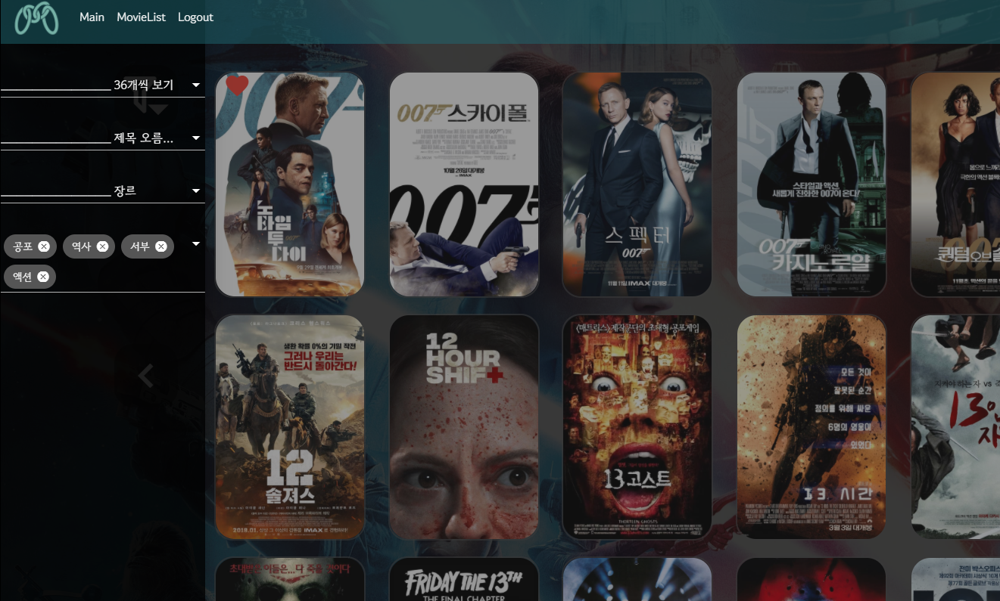
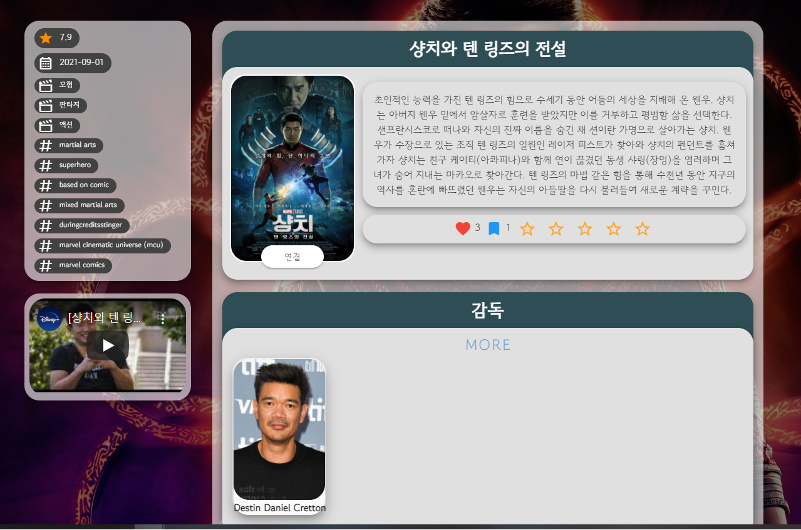

# MOIVE CHAIN

> FINAL PROJECT by 동옥, 아영

## 개발일정

> 2021.11.17 ~ 2021.11.25
>
> 

## 배포 URL

> https://moviechain.co.kr/

## PJT 컨셉

### Movie chain

- 사람과 사람을 잇는 영화.
- 사람과 영화 , 영화와 사람을 이어주는 연결고리같은 영화정보 커뮤니티 서비스

### Infinity Chaining

- 영화 → 사람 → 영화 → 사람 .. 으로 무한하게 이어질 수 있도록 설계

### Symbolic Movie

- 나를 상징하는 영화를 3가지 고를 수 있다.
- 나를 상징하는 영화는 프로필 페이지에서 뽐낼 수 있으며,
- 같은 영화를 지정한 사람들과 이어질 수 있도록 프로필페이지에서 같은 영화를 지정한 사람 목록을 볼 수있다.

## ERD (https://www.erdcloud.com/d/wybuwEuYN9ZSzGKiH)

- 넣고 싶은 기능이 많아서 하나하나 넣다보니 ERD가 매우 복잡해졌다.

  

- 유저

  - 이메일, 닉네임, 생일, 프로필 이미지, 배경색, 소개글, 팔로워, 채팅, 배우 팔로잉, 감독 팔로잉, 좋아하는 장르, Symbol Movie, Like Movie, Bookmark Movie 필드를 추가해 유저의 취향을 담을 수 있도록 모델 구성

- 영화

  - 검색을 쉽게 하기 위해 감독, 배우, 장르, 키워드 테이블을 따로 만들어 ManyToMany 필드로 연결해주었다.

## 목표

1. 관통프로젝트 목표
   - 영화기반 추천서비스 구성
   - 커뮤니티 서비스 구성
   - 실제서비스 설계
2. 우리의 목표
   - 1등 하기
   - 수업시간에 배운내용전부 사용하기
   - 생각나는 추가기능들 최대한 넣기
   - 당장 서비스 할 수 있을 정도의 퀄리티 만들기
3. 개발환경
   - Django REST API
   - Vue.js
   - Python
   - HTML
   - CSS
   - JavaScript
   - sqlite3
4. preview

## 메인 컨셉

## 프로토타입(목업) 이미지

## 추천알고리즘

- 박스오피스 순으로 영화를 순회하며 현재 순회하고 있는 영화를 일정확률에 따라 리스트에 담고, 영화 36개를 모아서 보여줌
- 현재 순회하고 있는 영화가.
  - 같은 Symbolic Movie를 지정한 다른사람이 지정한 Symbolic Movie라면 확률 추가
  - 나의 Symbolic Movie와 같은 장르, 키워드를 공유하고 있다면 확률 추가
  - 내가 선호하는 장르를 포함하고 있다면 확률 추가
- 나와 관련된 영화, 장르, 키워드를 사용해 취향에 맞는 영화를 추천할 수 있도록 하면서도, 대중들의 평가(박스오피스 순)와 확률적인 요소를 더해 좀 더 다채로운 영화를 추천받을 수 있도록 했다.

## 요구사항

vue에서 view를 리스트로 해서 그안에 어떤 기능들을 넣었는지, 설명

- 관리자뷰
- 영화정보
- 추천알고리즘
- 커뮤니티
- 우리의 페이지들

- 메인페이지 ⇒ 인피니티 스크롤
- 영화리스트 페이지 ⇒ 영화필터링 페이지네이션
- 영화검색(결과) 페이지

### 메인페이지(MainPage.vue)

- 로그인을 하기 전 메인페이지 에서는 로그인과 회원가입만 가능하다.
- 로그인을 하지 않으면 MovieChain을 이용할 수 없다.

- 로그인시 빨간색 커튼이 걷어지며, 검은색 단색배경이 나타남으로써 영화관에 입장한 듯한 느낌을 주고자 했다.
- 이후 MovieChain을 이용하면서 마지막으로 마우스를 오버한 영화의 백드롭 이미지가 배경으로 설정되도록 구현했다.

- 메인페이지에서는 

- 마우스를 아래로 내리면 추천알고리즘이 적용된 추천 영화목록을 열람할 수 있으며, 새로고침 버튼을 통해 새로운 리스트를 받을 수도 있다.

- 추천영화는 한번에 36개를 제공하며, 이후로는 박으로피스순으로 영화를 출력하고, 이후로는 인피니티 스크롤을 적용해 계속해서 스크롤 할 수 있도록 구현했다.
- 우하단의 맨위로 버튼을 이용해 최상단으로 이동할 수 있다.

### 영화리스트 페이지(MovieList.vue)

- DB에 저장되어있는 모든 영화리스트를 열람할 수 있는 페이지이다. 
- 각 영화는 포스터로 나타내었으며, 자신이 좋아요 또는 북마크 한 영화라면 상단에 아이콘으로 표시된다.
- 각각의 영화에서 아이콘을 클릭하여 좋아요, 북마크를 할 수 있으며 해당영화의 상세페이지로도 이동이 가능하다.

- 좌상단의 필터링 버튼을 클릭하면 사이드바가 나타나며, 이곳에서 한페이지에 출력할 영화의 개수, 정렬 순서를 지정할 수 있다.

- 또한, 배우, 제작진, 해시태그, 장르필터를 적용해 원하는 키워드에 해당하는 결과를 출력하도록 필터릴 할 수 있다.

### 영화상세정보 페이지(MovieDetail.vue)

- 영화상세페이지에서는 영화의 줄거리, 평점, 발매일 , 장르, 관련 키워드, 감독, 배우 및 관련 동영상 등의 영화 정보를 열람할 수 있다.
- 장르와 해시태그 chip을 클릭하면 각각의 장르나 해시태그로 필터링 된 영화 리스트 페이지로 이동하게 된다.

- 포스터를 클릭하면 영화 포스터를 자세히 볼 수 있다.

- 배우의 배역 명을 열람할 수 있으며 배우사진을 클릭하면 각각의 배우 프로필로 이동할 수 있다.

- 하단부에서 영화의 리뷰를 작성할 수 있다. 리뷰는 1인당 하나만 작성가능하며, 자신의 리뷰가 최상단에 고정되도록 구현하였다.
- 각 리뷰에는 댓글을 작성할 수 있으며, 댓글버튼을 누르면 각 리뷰에 작성된 댓글이 펼쳐져 보여지도록 구현했다.

​	

- 유저 프로필 페이지
- 인물(배우, 감독) 프로필 페이지

### 유저 프로필 페이지

- 개인의 취향을 담은 공간으로 유저에 관한 정보를 보여주는 페이지이다. 프로필 페이지의 배경색은 사용자가 선택할 수 있으며 선택한 색깔은 DB에 저장 돼 프로필을 커스터마이징 할 수 있다.

- 구현기능

  - 쪽지 기능

    

    - 다른 유저들과 대화를 할 수 있는 쪽지 모달창이다. 
    - 내 프로필 페이지에는 쪽지 확인 버튼이, 다른 사람 프로필 페이지에는 쪽지 보내기 버튼이 떠 다른사람에게 쪽지를 보낼 수 있다.
    - 아직 읽지 않은 메세지에는 빨간 뱃지를 달아 읽음확인을 할 수 있게 해주었다.
      - User 사이를 연결하는 Chatting 중개테이블을 이용해 구현했다.
      - 해당 정보를 보낸사람, 받은사람이 공유하고 있어 보낸사람이 쪽지를 삭제하면 받은사람에게도 삭제되는 이슈가 있어, user 필드를 추가해 해당 정보를 사지고 있을 유저를 지정해주었다.
    - 
    - 쪽지 내용을 클릭하면 자세한 쪽지 내용이 뜨고 상대방에게 답장을 할 수 있는 버튼, 삭제할 수 있는 버튼이 뜬다.

  - 연결기능

    - 유저 프로필 최상단에 최대 3개의 영화가 있다. 해당 영화는 본인을 상징할 수 있는 영화에 해당한다.
    - MovieChain의 메인 컨셉인 '연결'을 실현할 수 있는 버튼이다. 해당 버튼을 클릭하면 해당영화를 Symbol Movie로 지정한 유저, 좋아요한 유저, 저장한 유저 리스트가 뜨며, 이미지를 클릭해 해당 유저 프로필로 이동해 소통할 수 있고, 팔로우를 할 수도 있다.
    - 

  - 좋아요, 저장한 영화 리스트 확인.

    - 아래에 한줄의 리스트로 내가 좋아요한 영화, 내가 저장한 영화가 뜬다. MORE 버튼을 클릭해 큰 화면으로도 확인할 수 있다.
    - 

### 배우 & 감독 프로필

- 배우, 감독의 상세정보를 확인할 수 있는 페이지이다. 
- 배우는 출연한 영화 리스트가, 감독은 연출한 영화 리스트가 뜬다.
- 배우와 감독 역시 팔로우가 가능하며 해당 팔로우 정보는 유저 프로필 페이지의 팔로우 리스트 버튼을 클릭해 확인할 수 있다.
  

### 팀원정보 및 업무분담내역(역할)

- 강동옥
  - 팀장

  - 로고 디자인

  - css 및 애니매이션 구현

- 성아영
  - 백엔드 구현

  - 기본 구조 배치

### 목표 서비스 구현 및 실제 구현정도

- ERD 1.
- 필수기능 설명(자랑하고 싶은것들)
  1. 영화 상세페이지에 댓글처럼 리뷰를 작성할 수 있으며, 리뷰에 또 댓글을 작성할 수 있다.
  2. 다른유저 및 감독, 배우를 팔로우 할 수 있다.
  3. 프로필 페이지에서 나만의 테마색을 지정할 수 있다.
  4. 어떤 페이지에서든지 영화포스터에 마우스를 올리면 해당 영화의 Backdrop이미지가 배경화면으로 변경되도록 하여 다채로운 연출을 하였다.
  5. 로고 아이패드로 직접 그림~~
  6. 로그인과 로그아웃 시 커튼이 여닫히는 연출을 통해 좀 더 극적인 효과를 노려보았다.
- 기타(느낀점)
  - 아영이와 함께하는 세번째 프로젝트
  - 강동옥
     1. 하고싶은 것들이 많아서 필드를 이것저것 많이 만들었는데 최종적으로 사용하지 못한 것들이 몇몇 있어서 아쉽다.
     2. 중간에 컴포넌트를 나누려고 하니까 잘 안됬다.
     3. 교수님의 예언대로 model을 갈아엎고 또 엎었다
     4. transition을 추가해서 역동적으로 움직이도록 구현하고 싶었는데 알수 없는 이유로 transition이 실행되기도하고 안되기도 해서 조금 곤란했다.
     5. TMDB에서 데이터를 가져올 때 언어설정하는 방법을 잘 알지 못해 영어로만 데이터가 받아져서 당황스러웠다.
     6. 기능을 하나씩 구현해가는 과정에서 디테일적인 요소에 사로잡혀서 시간을 허비하는 경우가 왕왕 있었다
     7. 마지막 3일동안 12시간도 못잤는데 만드는게 너무 재밌어서 많이 피곤하지는 않았다.
     8. 뷰티파이를 처음 사용해봤는데 강력한 기능도 많았지만 현재수준에서는 마음대로 커스텀할 수 없는 부분들이 많아 약간 불편헀다.
     9. 결과물을 보니 목업때 작성했던 내용과 상당히 유사하게 나와서 목업의 중요성을 다시한번 깨닫게 되었다.
     10. 일주일동안 '왜안되지?'의 연속이었지만 그만큼 뚜드려 맞으면서 실력이 수직으로 상승한 기분이다.
     11. 초기에는 모듈화를 잘 해놓을려고 노력했지만 마지막에는 좀 미흡했던 것 같다
  - 성아영
     1. 초반에 목업을 만들었는데 실제 구현 ui가 처음에 만든 목업과 거의 흡사해서 개발 초기에 세우는 계획이 중요하다는 것을 깨달았다.
     2. 내가 원하는대로 데이터를 저장하고 불러오는 것이 생각보다 복잡하고 어렵다는 것을 느꼈다.
     3. 처음 계획과 다르게 개발을 진행하면서 추가하고 싶은 기능이 떠올라 생각보다 개발이 늦어졌지만 결과물이 만족스럽다.
     4. 한학기동안 배운 내용이 별거 없는 것 같으면서도 그것만으로 하나의 페이지가 완성된다는게 신기했다.
     5. 배포를 시도하다가 열두시간동안 뚜드려 맞고 곤죽이 되었다  (흠씬 맞으면서 배웠다).
     6. 단순한 게시판 기능도 사용자 경험을 고려해서 구현하려면 어렵다는 것을 느꼈다.
     7. 명세의 중요성을 깨달았다. 같은 프로젝트라도 명세가 있고, 없고의 차이는 프로젝트의 결과물과 그 과정에 큰 영향을 미친다는 것을 알았다.

### 만들려고 했던 것들

- 기본적인 리뷰 댓글 CRUD
- 유저 팔로우 & 차단
- 배우 & 크루 팔로우
- 프로필 사진
- 영화 좋아요, 북마크 ..
- 쪽지, 소개글
- OAUTH로 소셜 로그인 구현
- 신규 회원에게 가입환영 메일 발송
- 영화예매처와 연결서비스
- 쪽지 개수 뱃지
- api 요청 DOCS쓰기

### DB

- 최종 DB 영화기준 2000개 분량 
- DB 변경이력
  - 극중 캐릭터 이름을 저장하기 위해, ManyToMany 필드에 CharacterName 중개테이블을 추가.
  - 개봉일이 미정인 영화들이 입력됐을 때 Not Null Constraint 오류가 발생해 개봉일이 미정인 영화들은 1111-11-11의 기본값 입력되게 변경
  - 캐릭터이름이 null값인 경우 오류발생. models에 null값 가능하게 수정.
  - 유저 쪽지기능, 소개글 추가 
  - 배우 출생일, 사망일 필드 추가
  - 받은쪽지 삭제시 상대방이 보낸 쪽지도 동시에 삭제되는 이슈 발생 => 쪽지를 양방향으로 추가해서 해결
  - 영화 backdrop path 및 박스오피스 순서를 지정하기 위한 order필드 추가
  - 유저 background 색깔 필드 추가

